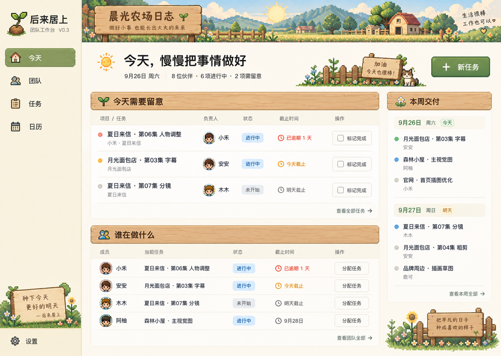

# 后来居上 V0.3：晨光农场日志

日期：2026-09-26。用途：交给 Sol 的设计与技术迭代方案。本文只制定方案；本轮没有修改应用源码、数据库结构或运行包。

## 1. 已确定的目标与执行依据

用户已选择第一张「晨光农场日志」。唯一主视觉基准已保存到仓库内：

原图尺寸为 1487×1058。它是视觉参考，不是可直接运行的界面，也不是现成的独立素材包。图中日期、人数、项目名、头像和任务均为演示内容，实现时必须来自实际数据。

本版核心只有三件事：**直观看到组内项目进度、组员正在做什么、哪些交付需要留意。** 操作者只有大组长本人，不需要代替员工重复完成提交与审批手续。

本轮目标版本为 **0.3.0**。这是已有产品的迭代：保留 React/TypeScript/Vite、Fastify、SQLite、历史记录、成员与小组、自定义头像/背景、深浅模式、周/月日历、备份恢复、Mac/Windows 构建能力。Windows 仍为默认正式主机，Mac 通过浏览器访问同一服务。

文档优先级：用户最新说明 → 本文 → 已选视觉图 → 旧技术方案。旧文档中“完成必须验收”“六项导航固定”“只做浅色”等冲突条款，以本文为准。旧截图审查报告仅作为问题证据，不是另一套并行需求：[V0.3 设计审查](docs/V0.3-设计审查与改版方案.md)。

不增加员工端、聊天、考勤、绩效、AI 预测、工时填报、养成游戏、积分、复杂审批、复杂甘特图或多人实时协作。UI 应当像一个舒适的农场工作室，操作仍使用直白的管理语言。

## 2. 当前问题与改版决策

本轮在隔离测试库中实际检查了：总览 → 待验收列表 → 打开详情 → 填说明并打回 → 重新登记提交 → 验收通过。截图和观察见审查报告，正式数据没有参与测试。

| 当前表现 | V0.3 决策 |
| --- | --- |
| 八张统计卡占掉首屏，具体人员在下方 | 数字合并为一行摘要，首屏优先实际任务和成员 |
| 进行中必须先登记提交才能验收完成 | 任务行直接“标记完成”，一个真实后端操作 |
| 大卡片只提供“查看并验收”入口 | 主要动作放在行内，详情用于阅读和低频编辑 |
| 修改意见绑在“打回”流程上 | 随时记一句进展；需修改时回到进行中，说明可选 |
| 首页、任务页、日历都依赖详情抽屉改字段 | 状态、截止日就地修改；完整表单用于创建和复杂修改 |
| 把实现用的“版本 3”等展示给用户 | 版本冲突保护保留在后台，界面不显示技术字段 |
| 普通后台配色加壁纸，缺少完整设计语言 | 从背景、材质、字体、图标、控件状态统一为已选农场主题 |

这些是根据本次页面观察和用户反馈作出的设计决策，不宣称已有完整性能或可访问性测试。

## 3. UI 设计规范：保留参考图的辨识度

### 3.1 必须保留的视觉元素

1. 左侧暖纸色导航，顶部「后来居上」，选中项为苔绿色木牌。
2. 顶部横向像素田园：山、阳光、草地、小屋、围栏；木牌文字「晨光农场日志」。
3. 主体为温暖的近白纸面，区块标题用浅木纹条，行内容干净易读。
4. 主区的「今天需要留意」「谁在做什么」，右侧的「本周交付」。
5. 绿色“新任务”主按钮，蓝色进行中、灰色未开始、绿色已完成、琥珀色留意、陶红色逾期。
6. 小花、麦穗、猫与幼苗等原创像素装饰，集中在页眉、侧栏底部和空状态。

不得把这张图简化成“米色背景＋绿色按钮＋几枚 emoji”。也不能整张效果图作为背景，再铺透明按钮冒充实现。文字、日期、计数、菜单、表单和列表都必须是真实 HTML/React 控件。

### 3.2 对参考图做的可用性优化

| 项目 | 落地尺寸/规则 |
| --- | --- |
| 左侧栏 | 200～216px；只放今天、团队、任务、日历；设置固定在下方，装饰不能遮挡设置 |
| 主区宽度 | 自适应，内边距 24px；大屏内容最大约 1600px，不把信息拉得过散 |
| 顶部农场横幅 | 104～120px；视口高度 ≤800px 时约 80px；其他页面可用 64～80px 紧凑页眉 |
| 欢迎区 | 约 80～96px，欢迎语一行，摘要一行；不重复堆放两块鼓励木牌 |
| 内容栅格 | 主列 `minmax(0, 1fr)`，周交付列 280～300px，间距 20～24px |
| 木牌区块标题 | 40～44px 高，文字用 DOM 叠加，纹理不承载正文 |
| 任务行 | 单行信息 60～68px，两行任务名/进展约 76px；标题最多两行，可展开完整内容 |
| 人员行 | 56～64px，头像 32～36px，显示姓名、小组、当前任务、状态、最近截止日 |
| 操作按钮 | 高 36～40px；图标按钮点击区域至少 32×32px，有清晰可访问名称 |
| 抽屉 | 通常 440～520px；页头与保存区清楚，内容可滚动，无多层抽屉堆叠 |

在 1280×800、浏览器 100% 缩放下，首页必须能看到至少 3 条待留意任务与至少 2 名成员；以压缩横幅和欢迎语满足，不能缩小正文或整体页面 zoom。首页留意列表首批最多 3 项，旁边提供“查看全部 N 项”；完整任务信息在过滤后的任务页。人员区默认按组展示，所有在职人员可随页面滚动看到，不默默只保留图里的四人。允许某一列表正常变长，不让整个页面出现横向滚动。

宽度不足约 1180px 时，周交付区域移至主区下方或收成可展开摘要，任务与人员仍优先。无需做手机交付，但浏览器放大时不能遮挡必要动作。不要让页眉和侧栏装饰永久占据大块固定可视高度。

### 3.3 建议设计变量

以下是基于已选图的初始设计值，Sol 应在真实渲染后校准，不是对原图精确取色的声称。

| 变量 | 初值 | 用途 |
| --- | --- | --- |
| 背景 | `#F7F1E4` | 页面暖纸底 |
| 纸面 | `#FFFCF5` | 数据面板、抽屉 |
| 主文字 | `#302C25` | 标题与正文 |
| 次文字 | `#6D675B` | 日期、小组、辅助说明 |
| 分隔 | `#E6DCC8` | 轻分隔线，不画 Excel 式格子 |
| 苔绿 | `#426744` | 主按钮、选中项、已完成文字 |
| 木色 | `#E5BB87` | 木纹标题底 |
| 木边 | `#987044` | 木牌边缘 |
| 进行中 | `#2B628E` / `#E5F1FB` | 文字 / 浅底 |
| 需留意 | `#875B19` / `#FFF0C9` | 今日/临近截止 |
| 已逾期 | `#A54436` / `#FBEAE5` | 文字 / 浅底 |

正文 15px、行高 1.5；辅助信息不低于 12px，核心日期和负责人不低于 14px；主标题约 26～30px，区块标题 18px。中文优先系统字体 `PingFang SC / Microsoft YaHei / sans-serif`。可以只给品牌标题使用一款许可明确的本地字体，但不要为像素风让全部中文变成难读的小像素字。

行项使用细分隔与少量浅底，避免卡片套卡片；正常表格语义可以使用，但视觉不做密集表格后台。默认交互只用 120～180ms 的轻反馈，不做粒子庆祝、反复晃动或打字机文字。

### 3.4 素材制作和使用规范

Sol 需要另行准备可落地的独立资产，不能认为效果图已经包含透明 PNG 和可切片按钮。

| 资产 | 建议输出 | 用法 |
| --- | --- | --- |
| 田园横幅 | 约 2400×320，无文字 PNG/WebP | 核心景物处于中间安全区，窄屏只裁边缘，禁止拉伸变形 |
| 木纹标题条 | 可平铺纹理＋边角片，或九宫格边框 | 随区块宽度伸缩；文字独立渲染，木纹不能挤压文字 |
| 导航选中底与主按钮材质 | 小尺寸可复用纹理 | 正常、悬停、按下、焦点和禁用状态统一 |
| 幼苗标识、花草角饰、小猫 | 各自独立透明 PNG | 仅装饰或品牌，不能取代有名称的功能按钮 |
| 功能图标 | 开源图标库本地子集 | 今天、团队、任务、日历、设置、加号、勾选、日期、更多 |

素材风格沿用已选图的像素密度、光线和配色；选中图可作为 ImageGen 参考分别生成单项资产。用户已选择方向，不要求重新生成三张方案或再次审批才能动工。若选定生成工具不可用，报告资产缺口并使用已有可用资产，不以临时 emoji 或 CSS 拼图声称已完成视觉还原。

像素图只对图像设置适当的 `image-rendering`，不作用于文字；尽量按整数尺度展示，检查实际尺寸下的清晰度。装饰设 `alt=""`/`aria-hidden`，不拦截点击。所有图片随应用构建本地交付，不依赖在线图片、字体 CDN 或远程头像。

不要搬用游戏安装文件中的人物/地图资源。现有用户头像原样保留；无头像时用暖色姓名首字即可，不要求每位成员制作角色，不根据姓名推断性别。效果图中的像素头像不是必填功能。

素材目标：新增首屏装饰资源压缩后合计尽量 ≤1.5MB，记录实际体积；可用静态资源缓存，不让素材加载阻塞数据和按钮。记录来源、生成方式、许可和用途，放在本地素材说明中。

### 3.5 现有显示功能的兼容

默认浅色为晨光农场。已有深色模式改为低饱和夜间农场：保留文字对比、纸面层次，不能对整页套 invert 滤镜。农场皮肤是统一设计，不再增加“传统后台/农场/多套主题商城”等设置。

自定义背景只作用于应用外层氛围底，不替代前景纸面、木牌和必要对比遮罩；已上传图片及遮罩偏好保留。首次升级若旧用户使用深色或自定义背景，遵守其已有选择，不静默清空。设置里提供简单“恢复默认外观”，不设计复杂调色器。

## 4. 信息架构与可视化

### 今天

页面结构固定为：轻页眉与“新任务” → 一行摘要 → 左侧上下两块「今天需要留意 / 谁在做什么」＋右侧「本周交付」。

- 摘要：在职伙伴 N 人、未完成任务 N 项、需留意 N 项，点击进入对应筛选。未完成包括未开始、进行中、待确认，不能错误标为“进行中”。
- 需留意：逾期优先，然后今日截止、人工标记可能延期、未来两日截止、其他待确认；同一任务只一行，可有多个文字徽标。严重程度相同按截止日及稳定 ID 排序。
- 留意行：项目/任务、负责人、状态、截止风险、标记完成、更多。截止日可点，状态可点。项目与负责人不要在多处重复占行。
- 人员行：按小组排列；同一成员只出现一行。多个未完成任务显示最紧急一项和“另有 N 项”，点开就地展开；协作任务计入并标“协作”。没有任务显示“可以安排新任务”，不是灰色不可用。
- 所有完成按钮作用于明确任务，不能在只显示成员名字的地方执行不明确的批量完成。
- 周交付按工作台时区周一至周日归日，不把历史逾期塞进今天的日历格。可简要显示已完成项以便回顾，其样式明确且不计当前风险。

空状态保留小幅插画和一个明确下一步。风险为空但有正常任务时显示“目前没有需要留意的交付”，仍显示人员任务；不把空状态误当整个团队没有工作。

### 团队

以小组和紧凑成员行展示，复用首页人员组件；提供新增成员、新建小组和现有快捷分组能力。行内突出姓名、职位、当前任务、状态和分配任务。组长标识保留；换组、暂停、离组等低频动作在成员详情中。

### 任务

默认显示未完成任务的轻列表，不新增一套强制看板或拖拽系统。筛选：全部/未开始/进行中/待确认/已完成，以及小组、成员、项目、需留意。标题关键词搜索保留；筛选写入 URL，返回时恢复位置。

“按项目查看”仅在此页提供轻分组，沿用 project_name，不新增一级“项目管理”导航。每组显示“已完成 3/8 项”，可用小型分段条对应各状态；这是任务数统计，不是预计工时进度。计数先按 task_id 去重，不能因多人协作重复累加。未填写项目显示“未归项目”；名字仅 trim 首尾空格，暂不做大小写合并、模糊合并或自动纠错。总数按当前成员/小组/关键词范围计算、在状态与风险子筛选前形成，标注“当前范围”，不能把筛选出的两条任务假装成项目全部工作。

### 日历与设置

保留现有周/月切换、按截止日展示、点击空日期新建任务和筛选；改为同一纸张木牌风格。日期修改用轻弹层，不引入新排班算法。设置继续提供已实现的外观、数据、备份和局域网能力，视觉统一，技术路径与维护信息放折叠区域。

### 待确认入口

移除独立“待验收”一级导航，统一到 `/tasks?status=pending_review` 和首页提醒。旧 `/reviews` 路径重定向到该筛选；旧 API 可暂时保留兼容。不能因为隐藏导航而漏掉旧待验收任务。

## 5. 简化交互：动作预算与反馈

以下“点击数”不含输入文字和选择具体日期所需的操作；它用于限制多余页面跳转，不是强制埋点或用户绩效指标。

| 用户想做什么 | 目标操作 |
| --- | --- |
| 完成一项任务 | 在可见行点“标记完成”，1 次点击；不弹确认、不先提交 |
| 修改截止日期 | 点日期 → 日历弹层选日期或快捷“今天/明天/下周一”即保存；可输入日期按 Enter；无需打开全表单 |
| 更新状态 | 点状态 → 选目标；2 次点击，不跳页 |
| 给某人安排工作 | 成员行“分配任务” → 已带负责人，填任务名和截止日 → 保存 |
| 标记可能延期 | 更多 → “标记可能延期”；原因选填，不能成为额外必填表单 |
| 记一条当前进展 | 点“记进展”/当前进展 → 就地输入 → 保存；只维护一处 |
| 查看详情 | 点任务标题，右侧抽屉；行内按钮不会顺带打开抽屉 |
| 完成后继续派单 | 成功反馈中的“安排下一项”，负责人自动带入，不自动弹新表单 |

新建任务首屏只必填任务名、负责人、截止日。项目名可在三项下方直接选填并提示历史值，便于项目可视化；小组、协作者、开始日、描述与优先级放“更多”。从人员、日期或项目分组入口创建时带入对应上下文。不强制填写进度百分比、工作阶段或验收理由。

完成后显示“已完成 · 撤销 · 安排下一项”的轻提示约 8 秒，聚焦/悬停时暂停消失。列表不自动回顶部，焦点回到合理的相邻行。提示过期后，可在已完成任务详情中“重新打开”，保留补救入口。快速处理多项时，反馈必须与具体 taskId 绑定，不能撤销错任务。

保存过程中仅禁用相关控件，显示保存中；以服务端成功为准更新已保存状态。失败留住输入并就地解释。409 冲突刷新服务器数据，但保留用户待提交内容，不静默覆盖；网络失败不自动重复执行写请求。标题点击区和行内按钮应是兄弟元素，不能 button 套 button。

表单保持单层抽屉，未保存关闭时才询问是否放弃。状态/日期轻弹层优先使用可访问的 Popover/Dropdown；键盘 Esc 关闭并归还焦点。危险动作如删任务、恢复数据库延续确认，普通完成和改状态不增加确认层。

## 6. 状态、风险与数据：只改必要部分

### 6.1 状态与兼容

继续使用现有四个数据库状态，避免无必要重建状态字段：todo、in_progress、pending_review、completed。界面将 pending_review 文案改为“待确认”，仅在需要时使用。

| 命令 | 允许来源 | 结果 | 记录 |
| --- | --- | --- | --- |
| start | todo | in_progress | 开始 |
| complete | todo / in_progress / pending_review | completed | 直接完成，保存前状态等快照 |
| mark_pending | todo / in_progress | pending_review | 标记待确认，不伪造员工提交 |
| resume | pending_review | in_progress | 继续修改，说明可选 |
| reopen | completed | in_progress | 重新打开，清空当前完成时间 |
| reset_to_todo | in_progress / pending_review | todo | 在状态菜单“设为未开始”，保留历史 |
| undo_complete | 当前仍为该次 complete 的结果且版本一致 | 该次完成前的状态 | 撤销完成事件，不删除历史 |

普通任务编辑接口不能绕过状态命令。所有动作在事务里校验 version、更新任务、写事件并递增 version。前端不能串联 submit/approve 模拟完成；未开始直接完成不应伪造开始时间。相同请求/双击不得重复完成或产生重复事件，过期版本返回明确冲突。

complete 设置 completed_at，若仍维护旧 progress 字段则置 100。undo_complete 由服务器根据 completion event 的快照恢复原状态、progress、completed_at 和人工风险；不接受客户端任意指定恢复状态。完成后只要发生后续修改，就拒绝旧撤销，提示从任务详情重新打开。reopen 为新的工作阶段，progress 置 null、completed_at 置 null，不自动恢复旧人工风险。

旧 submit/approve/reject/undo_approve 接口在需要时兼容，原提交、通过、打回历史原样可读；新 UI 的动作使用新语义。旧 pending_review 不变为已完成，也不清空 submitted_at。新的待确认时间可以由最新 mark_pending 事件推导，与旧 submitted_at 区分。

成员忙闲继续由其当前负责人/协作者关系自动计算；未开始为已安排、存在进行中为工作中、全部待确认为待确认、无未完成任务为空闲。暂停/离组不进可派工计数，历史仍可查，不为新主题重写人员关系。

### 6.2 风险口径

- 已逾期：deadline < 工作台 today，且未完成、未删除；“逾期 N 天”按业务日期算，不混用客户端时区。
- 今日截止：deadline == today，且未完成、未删除。
- 临近截止：未来第 1～2 天截止，且未完成、未删除。
- 可能延期：大组长手动标记；需要时可填一句原因，人工解除后写事件。
- 待确认超期：pending_review 且逾期，明确显示该含义，不混淆为员工制作延期。

临近截止不是“系统预测会延期”，也不从任务数量/未知进度推断风险。完成会清除当前人工风险字段但事件留存，重新打开默认无风险；即时撤销该次完成则从快照恢复。修改截止日自动重算日期风险，但不自动清掉人工标记的原因。同一任务多个风险徽标可共存，需留意计数按任务去重。

### 6.3 最小迁移与接口扩展

建议在 tasks 增加 `latest_update TEXT NULL`、`latest_update_at TEXT NULL`、`risk_flag INTEGER NOT NULL DEFAULT 0`、`risk_note TEXT NULL`。进展备注最多约 280 字，风险原因最多约 200 字；清空允许，后端校验。task_events 沿用现有结构增加类型和 payload，不新增审批表、项目表、风险系统或复杂审计服务。

更新进展同时更新显示字段和事件；时间由服务端产生。风险原因变更也写事件，clear 时清除当前原因。版本迁移使用下一个可用序号；目前最新为 0004_media.sql，执行时复核后再命名，不能覆盖旧 SQL。

`/overview` 继续作为首页数据来源，补充去重风险、摘要与人员最近进展；项目汇总可在现有 tasks 查询层聚合，规模只有 10～20 人，不为此引入缓存服务。日期、风险、状态展示逻辑放共享纯函数，不能首页和日历各算一套。新旧字段命名沿用项目 DTO 约定，不在各页面散落转换。

开发迁移与 UI 测试使用隔离数据目录，迁移前备份，保留旧数据、媒体、组别历史和事件。当前 dev-server 脚本会自行设置 DATA_DIR，Sol 必须检查并修正其对显式 DATA_DIR 的尊重，或用安全的独立启动命令，不能以为设置环境变量就一定隔离成功。

## 7. GitHub 调研：具体采用什么

调研日期 2026-09-26，以下来源均为官方项目或官方文档。所谓“成熟”以现有兼容性、控件行为和维护负担判断，不以星数替代验证。没有找到、也不需要一个直接适配当前业务的整套星露谷后台模板。

| 方案与来源 | 能解决的问题 | 本项目决定 |
| --- | --- | --- |
| [Radix Primitives](https://github.com/radix-ui/primitives) / [Popover](https://www.radix-ui.com/primitives/docs/components/popover) | 无固定皮肤的交互基础、焦点和键盘处理；项目已使用 Dialog/AlertDialog | 继续使用，按需增加 Popover/Dropdown。装饰自己做，交互不从零发明 |
| [shadcn/ui](https://github.com/shadcn-ui/ui) / [日期选择示例](https://ui.shadcn.com/docs/components/radix/date-picker) | 可直接阅读与定制的组件源码，日期/选择器组合方式 | 只按需采用与现有 Radix 栈兼容的组件；不导入整个后台模板，不覆盖现有样式体系 |
| [React DayPicker](https://github.com/gpbl/react-day-picker) | 可定制日期选择、中文本地化，适合小弹层内改期 | 如原生日期输入难以统一体验则采用。锁定选用主版本，核对 shadcn 示例兼容性；仓库当前说明 v10+ 推荐包名为 @daypicker/react，不能混抄 v9 API |
| [Pixelarticons](https://github.com/halfmage/pixelarticons) | 24×24 网格的像素功能图标，可本地 React/SVG 使用 | 从免费 MIT 集合挑小子集，不用 Pro/远程 CDN；适合功能图标，不替代彩色农场插画。保留许可证 |
| [Sonner 官方站](https://sonner.emilkowal.ski/) / [源码入口](https://github.com/emilk/sonner) | React 轻提示和动作入口 | 若现有反馈组件不够用，按需用于完成/撤销，不能当消息中心；本次官方站可读，源码页抓取失败，安装前再核实当前版本与许可 |
| [NES.css](https://github.com/nostalgic-css/NES.css) | 8-bit 边框与按钮风格；代码 MIT，CSS-only | 仅参考局部设计，不整库覆盖全局。其默认英文字体不能保证中文可读性 |
| [RPGUI](https://github.com/RonenNess/RPGUI) / [StardewUI](https://github.com/focustense/StardewUI) | 前者为复古网页游戏 UI，后者为 Stardew 模组 UI | 只作视觉/组织参考，不作为现有 React 管理工具的替代技术栈 |

最终推荐：**现有 React + Radix 控件行为 + 自定义农场视觉资产 + 按需日期选择器与少量像素图标。** 保留当前 TanStack Query / React Hook Form / Zod。全部候选并非都必须安装；每项新增依赖应能指出解决了哪一个具体操作问题，锁版本且保持离线运行。没有采用外部仓库的安装脚本或复制其配置作为本项目指令。

## 8. 对现有代码的改动地图

以下路径均相对仓库根目录，是供 Sol 定位的规划，不表示本轮已修改。

| 现有文件/区域 | 计划修改 |
| --- | --- |
| apps/web/src/App.tsx | 新外壳、导航、已选主题、旧 reviews 路由兼容、保留主题/背景偏好 |
| apps/web/src/style.css | 整理为设计变量、布局、组件样式和主题；不要在末尾不断叠加覆盖造成两套视觉共存 |
| apps/web/src/ui.tsx | 统一按钮、木牌区块、任务行、人员行、标签、日期弹层、提示和焦点样式 |
| apps/web/src/pages.tsx | 总览布局、任务行内操作、人员紧凑视图、按项目汇总、日历皮肤；逐页适度拆分 |
| apps/web/src/drawers.tsx | 移除强制审批主流程，保留详情历史，简化任务创建/编辑，防止嵌套抽屉 |
| apps/web/src/settings.tsx | 统一农场外观，保留背景/头像与现有维护能力 |
| apps/web/src/api.ts | 新字段/状态命令、统一请求及中文文案 |
| apps/web/src/main.tsx | 必要的轻提示容器；保留现有查询刷新能力 |
| packages/shared/src/validation.ts、rules.ts | 新命令校验、统一风险与日期规则、兼容四状态 |
| apps/server/src/tasks.ts、views.ts | 原子 complete/undo/reopen，进展/风险、汇总；沿用已有 version 保护 |
| apps/server/src/schema.ts、drizzle/ | 更新实际 schema 定义和增量迁移，保留所有旧数据 |
| apps/web/public/assets/farm/ | 最终独立静态素材；设计参考图留 docs，不打包整张效果图当页面 |
| package manifests、lock、健康接口、scripts/check-version.mjs、README、docs | 统一 0.3.0 与实际 schema 版本；补版本校验和新使用说明 |

已经发现根 package.json 为 0.2.0、子包仍为 0.1.0，健康接口中应用/schema 版本硬编码；V0.3 发布需要统一检查，不能只改网页上的版本标签。现有 SQL 与 Drizzle 定义共同核对，不借机重写持久化层。

## 9. 实施顺序与验收标准

| 阶段 | Sol 应交付 | 通过条件 |
| --- | --- | --- |
| A 设计落地骨架 | 已选图对应的基础素材、设计变量、应用外壳、首页 | 在真实浏览器里像选定方向；1280×800 首屏已出现实际任务与人员，不只有插画 |
| B 核心操作减负 | 直接完成、撤销、改期、记进展、风险标记及后端必要变更 | 行内完成与改期可用；不走隐式提交/审批；失败可恢复 |
| C 全站统一 | 团队、任务、周/月日历、设置、抽屉与全部状态 | 不出现首页像农场、二级页仍像旧后台的断层；旧功能与历史保留 |
| D 升级与交付 | 升级测试、视觉 QA、说明、0.3.0 包与构建配置 | 已执行测试有记录；未执行 Windows/局域网验证明确列出，不宣称已完成 |

不要在阶段 A 花完精力后交付一张静态首页。也不要先完成一套普通后台，最后只加背景图交差。各阶段持续推进，无需用户逐项重复批准已经选定的方向。

验收用例：

1. 新任务只必填三项；成员入口已带负责人；项目可直接选填，不先建立项目实体。
2. 未开始、进行中、待确认都能直接完成，只有一个真实写操作和一条对应完成事件；旧待确认不会自动消失。
3. 完成后撤销恢复该次完成前状态；若其他浏览器已修改则拒绝覆盖；已完成筛选仍能找到记录。
4. 从行内改期，首页/成员/日历/项目摘要一致；日期弹层与抽屉嵌套时不穿透、不截断。
5. 人工延期与日期风险可区分；“明天截止”不能被写成预测会延期。跨午夜、跨月、跨年周正确。
6. 8 人、20 人、多任务协作者、无任务、长中文任务名、零风险、旧待验收、离组和停用组均可读；统计按规则去重。
7. 同项目任务分组可见已完成数量，不假装精确工时百分比；没有项目的任务仍可用。
8. 新旧浅/深色偏好、自定义背景、头像、历史、备份恢复不丢失；旧库副本可迁移。
9. 对照已选图检查 1487×1058，并检查 1280×800、1440×900、1920×1080；提供首页、团队、任务、日历、创建、详情和深色关键截图。
10. 截图只能证明外观；还要实际点击完成/撤销/改期/分配/失败重试并检验数据库。键盘 Tab/Enter/Esc、焦点、正文对比、无悬停才能发现的唯一入口需要实测。
11. 断开互联网时本地素材和核心功能可用，装饰图不影响任务加载；局域网失联不假报保存成功。
12. 根包、子包、锁文件、API、打包名和文档版本一致；新包与旧包并存。Windows 与真实 LAN 验证未执行时明确记录。

验证方式沿用 Vitest、Fastify inject 和项目可用浏览器工具；对新增状态机、风险、撤销冲突和迁移添加有意义的测试。视觉需要实际截图对照，不能只凭 npm build 通过认定完成。

## 10. 直接发给 Sol 的执行提示词

> 请在当前已有项目上实现 V0.3「晨光农场日志」。先完整阅读仓库根目录 `V0.3开发迭代方案与Sol提示词.md`，打开并实际查看 `docs/v03-design/晨光农场日志-已选视觉基准.png`，然后检查现有代码与本地约束。
>
> 用户已经选定该视觉方向，执行交由你完成。核心是可视化项目进度、组员正在做什么与交付风险，只有大组长本人使用。请保留现有架构和数据，以这份 V0.3 方案为准覆盖旧文档中强制提交验收、固定六项导航等冲突条款，不重新从零创建项目。
>
> 最重要的交付是两件事：一、真正还原已选图的田园像素横幅、木牌、暖纸面和整体农场质感，同时让中文可读、笔记本首屏可见任务与人员；二、用行内直接完成、改期、简短进展与可解释风险取代繁琐审批手续。不要只换背景颜色，不要把整张效果图当界面，不要把像素效果用 emoji 临时替代。所需独立插画资产按方案制作并本地保存。
>
> 继续使用现有 React/Radix/TanStack Query/Fastify/SQLite；按需参考本文核查的开源组件，不整套引入另一个后台或游戏引擎。不新增员工账号、工时、绩效、AI 预测、多人协同或养成玩法。
>
> 按方案 A→D 推进：先做视觉基础与真实首页，再完成直接操作及后端必要变更，再统一其余页面，最后做旧库迁移、交互、截图和打包验证。每阶段简短说明结果，常规实现自主推进，不要求我重复选择已选风格。仅在无法继续的缺失权限/环境或重大产品歧义上明确说明问题。
>
> 使用隔离测试数据，保护真实数据库、图片和历史。新状态命令须原子执行，有版本校验，不能前端串联提交/验收伪装一键完成。使用真实任务渲染所有统计，不要把效果图的演示文字、日期、头像、数量写死。
>
> 完成时交付可运行结果、关键页面对照截图、已执行测试、0.3.0 版本说明和构建产物；真实 Windows/局域网或离线测试没执行就列为未验证。不要把只生成页面、只生成 ZIP 或只通过构建当作全部完成。

如果新任务没有当前仓库文件，请一并提供本文、已选视觉基准图和完整项目源码；无需把三张候选图或整段旧聊天全部发过去。
