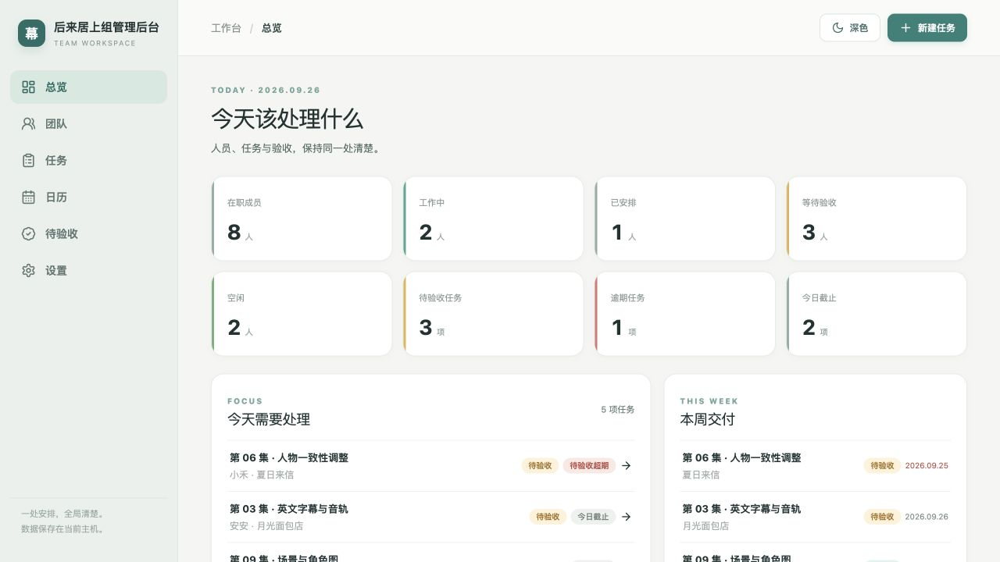
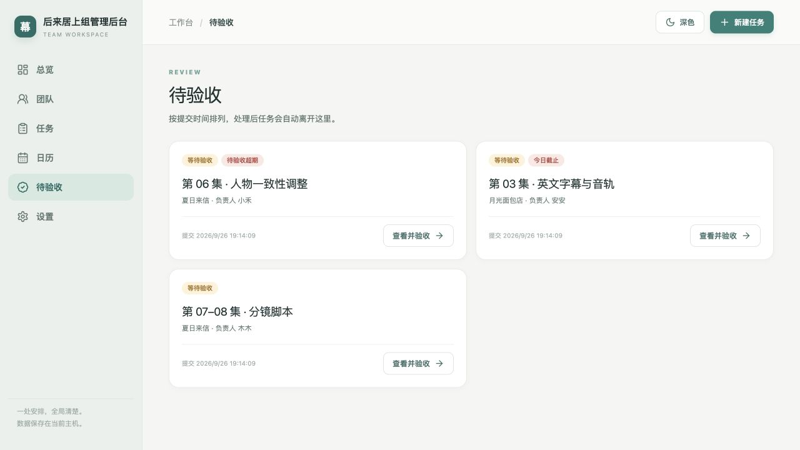
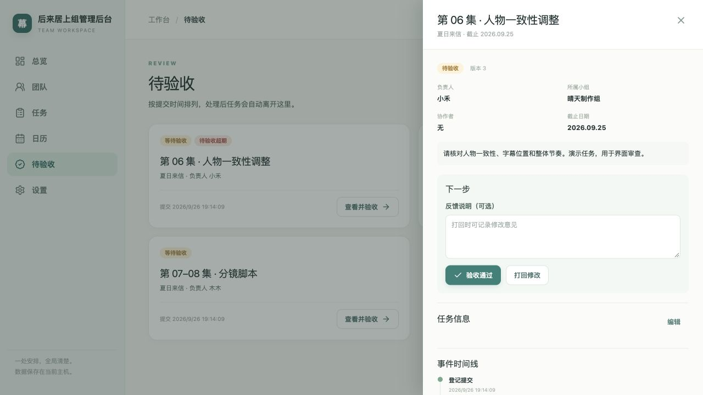
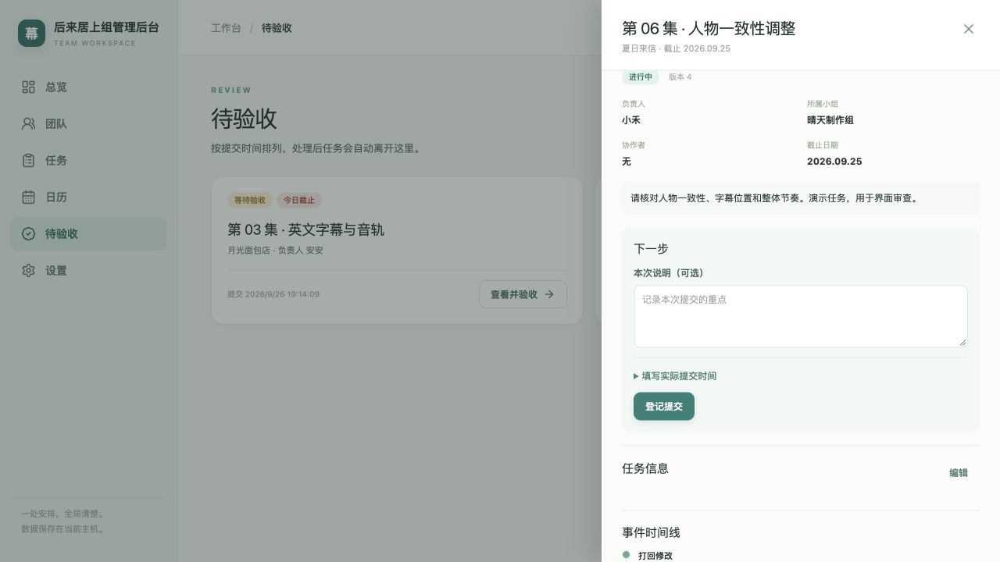
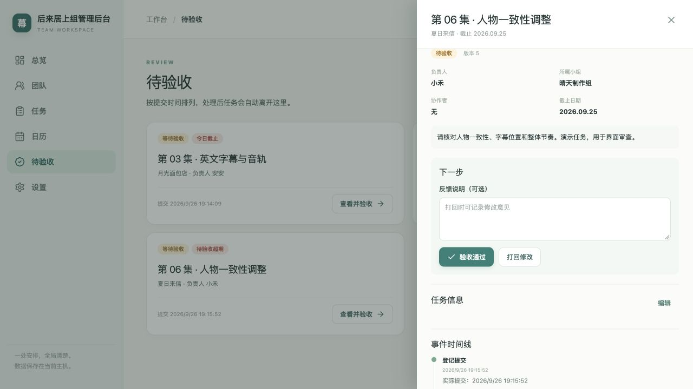
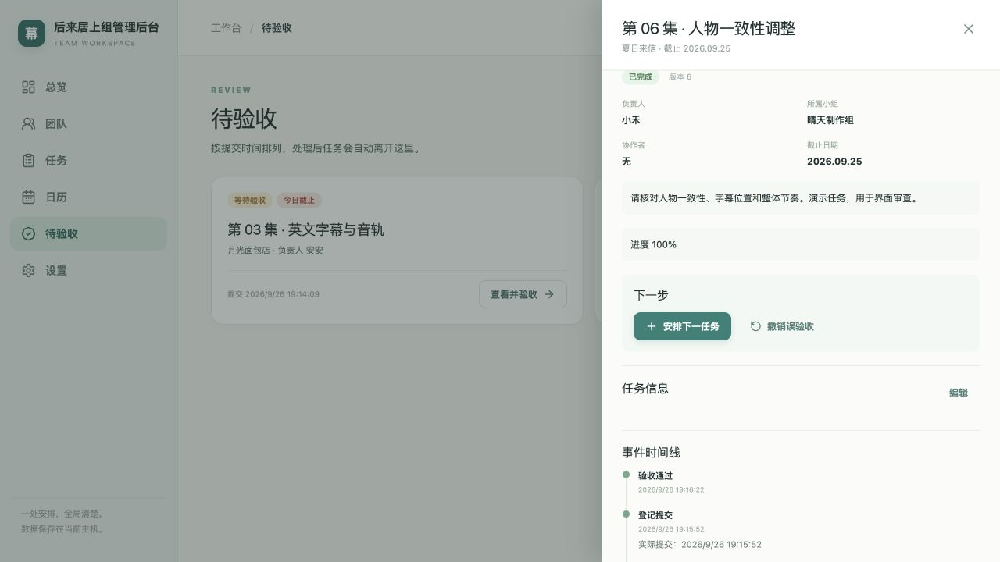

# V0.3 农场主题与单人进度工作台

日期：2026-09-26。阶段：已完成当前版本流程审查；用户已选择第一版「晨光农场日志」，尚未修改业务实现。

本文保留审查证据与早期设计建议。最终执行以根目录 [V0.3 开发迭代方案与 Sol 提示词](../V0.3开发迭代方案与Sol提示词.md) 为准，包含已选视觉基准、完整 UI 规格和简化交互规则。

## 已确认方向

- 用户本人使用、本人录入和更新，不做员工在线协作。
- 版本目标改为 V0.3；当前仓库已为 0.2.0，保留其背景、头像、深浅模式和周/月日历能力。
- 星露谷农场式的温暖、治愈、自然、像素细节；不等同于粉色后台，也不把员工变成需要养成的游戏角色。
- 核心问题是“项目推进到哪里、谁在做、什么时候交、哪里可能延期”。提交/验收不是必须执行的管理手续。
- Windows 主机、Mac 浏览器访问以及双平台运行包方向继续保留。

## 本次审查证据

运行当前本地构建页面，在独立数据目录 `/private/tmp/workbench-v02-design-audit` 创建 2 组、8 人、6 项虚构任务。未操作正式数据库。截图保留于 `docs/v02-design/`，这里的 v02 指被审查版本，不是本次改版目标。

| 步骤 | 实测操作 | 健康度与发现 |
| --- | --- | --- |
| 1 | 打开总览 | 统计准确表达了人/任务单位，但 1280×720 首屏被八张数字卡占据，“谁在做什么”未进入首屏 |
| 2 | 进入待验收 | 页面能列出待验收任务，但不能就地完成；大卡片信息稀少，仍需“查看并验收” |
| 3 | 打开任务详情 | 有真实状态、反馈框和两种动作；遮罩使其他任务不能同时处理，“版本 3”等实现信息占用产品界面 |
| 4 | 填说明并打回 | 状态和历史正确更新；抽屉继续停留在刚处理的任务，下一项需返回列表再打开 |
| 5 | 再次登记提交 | 进行中不能直接完成，必须先代录提交；对单人使用产生额外手续 |
| 6 | 验收通过 | 状态正确，保留继续派单和撤销；仍是审批式文案，“下一步”区域过大 |

### 截图

1. 总览：

2. 待验收列表：

3. 验收抽屉：

4. 打回后：

5. 再次提交：

6. 完成后：

共同优点：已有真实持久化、历史和状态流转，导航明确，反馈可以选填，完成后支持继续派单。优先保留这些基础。

视觉与可访问性风险：标签、时间、小按钮偏小且颜色较淡，实际操作区占屏幕比例低；这是从截图观察到的阅读风险，尚未进行对比度数值、屏幕阅读器、完整键盘或 Windows 浏览器认证。本次不能宣称全面可访问性合规。

审查范围限于总览和提交/验收/打回/完成链路。其他页面的全部状态、真实作品查看、网络故障和跨设备行为未在本轮重测。

## V0.3 交互规格

### 1. 直接维护任务进度

默认状态展示“未开始 / 进行中 / 已完成”。保留可选的“待确认”，兼容旧 pending_review 数据，不能自动把旧待验收当成完成。

常用动作：

- 未开始：开始、标记完成（允许补录已经做完的任务，不伪造开始或提交事件）。
- 进行中：标记完成；更多中可“稍后确认”。
- 待确认：标记完成、继续修改（回到进行中，备注可选）。
- 已完成：重新打开（回进行中，清空当前完成时间并保留历史完成记录）。

新增明确的 complete/reopen 等业务命令并验证状态、版本和事务；不要由前端依次偷偷调用 submit + approve 来模拟一键完成。旧 approved/rejected/submitted 事件原样保留，新事件按实际行为命名；不继续强制 V0.1 文档中的验收必经规则。

任务列表/首页的行内提供状态及完成操作，完成后保持位置并显示短暂撤销入口。撤销使用最新版本校验，不覆盖后续修改；需要保存原状态以便恢复，待确认任务撤销回待确认。修改说明通过就地展开输入，不用另开审批页面。保存失败保留输入、恢复状态；成功以后再显示完成反馈。

### 2. 明确“走到哪一步”

卡片显示任务阶段和最近一条进展备注，例如“配音已完成，正在校对字幕”。进展备注选填，不要求日报、百分比或每天更新。若新增最近进展字段，写入同时记录事件；历史备注可读，不要求用户维护两份文本。

项目沿用 project_name，自由文本与已有值建议即可。项目汇总展示“完成 3/8 项、进行中 4 项、待开始 1 项”和最近交付日；这只是任务数汇总，不声称是工时完成度。不新增复杂项目管理实体或强制工作阶段模板。

### 3. 风险可解释

- 已逾期：截止日早于工作台 today 且未完成，按现有业务时区判断。
- 今日截止：截止日等于 today 且未完成。
- 临近截止：未来 1～2 天截止且未完成，文案仅表示日期接近，不等同于预计延期。
- 可能延期：用户手动标记，原因选填；可以独立于状态存在并手动解除。新字段/事件采用版本迁移，旧任务默认无人工风险。
- 待确认任务仍可超期，但明确标“待确认超期”，不把它归咎于员工制作延期。
- 完成后不再进入当前风险清单，历史风险记录保留；重新打开不自动恢复已解除的风险。
- 不引入 AI 预测、强制工时记录或按进度百分比臆测延期。

### 4. 首页与导航减负

首页以“需要留意的交付”和“谁在做什么”为主，统计收成一行，首屏看到实际任务与负责人。顶部只保留明确的新任务入口；正文不堆八张统计卡。

日常导航建议为：今天、团队、任务、日历；设置放底部。待确认成为任务内的筛选及首页提醒；旧 /reviews 地址继续兼容或重定向到待确认筛选，不丢旧链接与数据。此项是基于用户最新授权对原六项固定导航的修订。

新建任务仍只必填名称、负责人、截止日，从人员入口创建自动带入负责人。小组、协作者、项目名与描述渐进展开。保留上下文和列表滚动位置。

## 视觉规格

- 原创农场、木牌、纸张、草地、花朵、季节光线，表达星露谷式舒适感。
- 装饰在页眉、侧栏底部和空状态；数据区域保持干净，不能用大面积风景挤掉操作区。
- 用像素插画/边缘细节营造主题，正文使用可读中文字体，主要操作文字 14～16 px。
- 信息颜色：按已选图采用蓝色进行中、苔绿已完成、蜂蜜色需留意、柔和陶红逾期；配合文字，不仅依赖颜色。
- 保留“标记完成、改截止日、分配任务”等清楚词汇，不把必要操作全部改成“收获、播种”等游戏隐喻。
- 无养成数值、积分、金币、强制庆祝动画；尊重减少动态效果偏好。
- 用户已选择第一版「晨光农场日志」；执行时沿用已选图制作独立素材并落实到现有项目，不重新要求选择风格，不新建无关原型或替换后端。

## GitHub 参考与采用边界

| 来源 | 可参考内容 | 决策 |
| --- | --- | --- |
| [NES.css](https://github.com/nostalgic-css/NES.css) | 8-bit 按钮、边框、交互状态；CSS 组件，README 标注代码 MIT | 参考局部细节，不全局覆盖现有控件；其推荐英文字体不能直接解决中文排版 |
| [RPGUI](https://github.com/RonenNess/RPGUI) | 复古 RPG 面板与质感 | 参考构图与材质方向，不整体引入另一套 DOM/JS 控件 |
| [StardewUI](https://github.com/focustense/StardewUI) | 游戏 UI 的布局组织思路，面向 Stardew 模组 | 不是 React Web 组件库，不作为项目依赖 |

本轮未复制第三方素材或安装这些库。保留 React、Radix、TanStack Query 和现有 API；新增图像使用原创资源并保存到项目，保持离线可用。

## 实施与验收

1. 按已选视觉方向和最终方案，落地首页、任务行、详情抽屉及状态菜单的样式。
2. 在现有后端增加直接完成、重新打开、风险及进展记录；以隔离的旧库副本验证升级，迁移前备份。
3. 改造首页与任务交互，再覆盖团队、日历、设置和旧待验收入口。保留自定义背景/头像及深浅模式，确保主题可读性。
4. 自动测试新旧状态转换、撤销冲突、风险日期边界、历史记录、数据库升级；浏览器实测高频操作。
5. 统一根包、子包、健康接口、版本脚本、README 和使用说明为 0.3.0；生成新名称运行包，不覆盖旧包。

目标：从可见任务行一击标记完成；改期点击日期后选择日期并保存，无需打开通用编辑表单；新增任务只填三项；无需填写验收说明即可结束工作；1280×800 首屏可见实际任务、负责人及截止风险。

正式发布继续需要 Windows 构建和实机/局域网验收，不能因仅改 UI 就沿用未执行的兼容性承诺。此文档优先于旧技术提示词中强制验收、固定六项导航等与新需求冲突的条款，其余持久化与交付约束继续适用。
